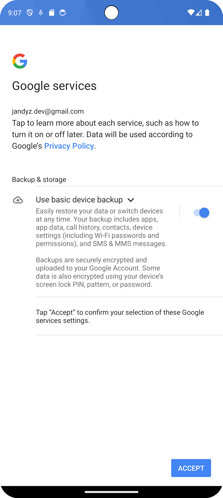
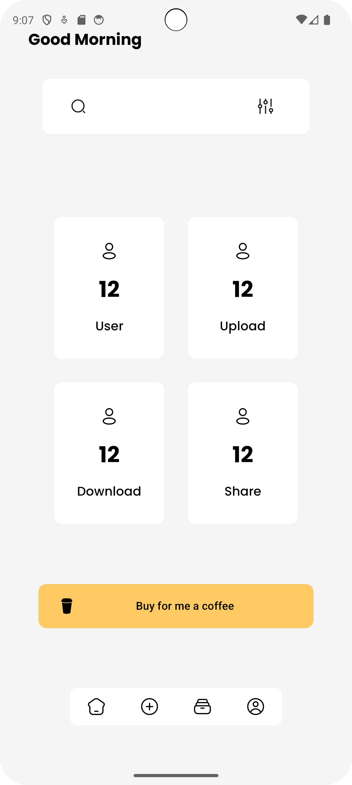
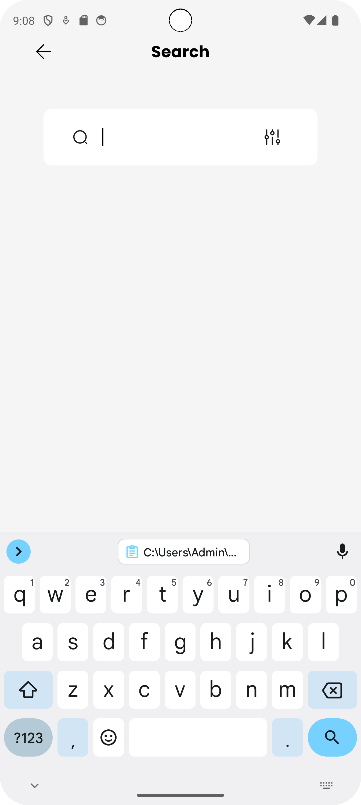

# Up And Share - Mobile App

      
## Features

- Allows users to upload and download images.
- Provides a user-friendly interface for managing and viewing images.
- Integrates with storage services to manage image files.

## Technologies Used

- **Kotlin**: Programming language.
- **MVVM**: Architectural pattern.
- **LiveData**: For observing data changes.
- **Jetpack Compose**: For building the UI.
- **Firebase**: For storing and managing images.
